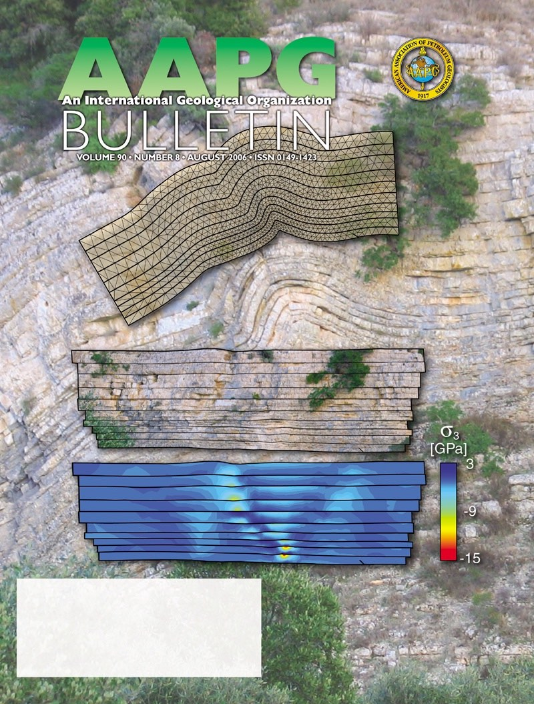

# 
Cassini

This is the official documentation of **Cassini** for JavaScript and TypeScript.
**Cassini** is a FEM code which allows to perform structural restoration using geomechanics.
It is mainly based on the publication [L. Maerten, F. Maerten, 2006, Chronologic modeling of faulted and fractured reservoirs using geomechanically based restoration: Technique and industry applications, AAPG Bulletin](https://pubs.geoscienceworld.org/aapgbull/article-abstract/90/8/1201/132783/Chronologic-modeling-of-faulted-and-fractured?redirectedFrom=fulltext)
  

**Cassini** can be run either from the frontend (web browser) or in the backend (using [node.js](https://nodejs.org/en/) or [Python](https://www.python.org/)).

## Documentation
See the [online](https://youwol.github.io/cassini-doc/dist/docs/modules.html) generated documentation.
  
